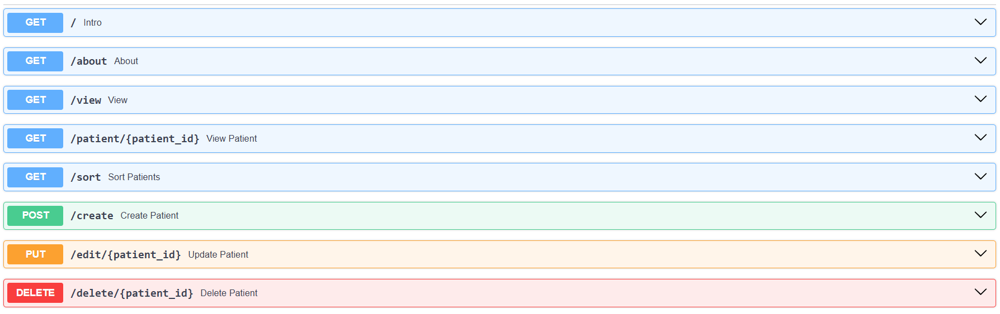

# Patient Management System

This project is a **Patient Management System** built with **FastAPI** and uses a `patients.json` file as the backend storage for patient records. The system allows complete **CRUD operations**—Create, Read, Update, and Delete—on patient data.

---

## 📁 Project Structure

- `PMS.py`: Main FastAPI app where routes and logic are defined.
- `patients.json`: JSON file that stores all patient records.

---

## 📦 Features

✅ Add new patients  
✅ Retrieve patient details by ID or all patients  
✅ Update existing patient information  
✅ Delete patient records  
✅ Auto-calculation of **BMI** and **health verdict**  
✅ Clean, RESTful API with **FastAPI**

---

## 📊 Sample Data (patients.json)

```json
{
  "P001": {
    "name": "Rita",
    "city": "Dhaka",
    "age": 28,
    "gender": "female",
    "height": 1.65,
    "weight": 90.0
  },
  "P002": {
    "name": "Rakib",
    "city": "Mumbai",
    "age": 35,
    "gender": "male",
    "height": 1.75,
    "weight": 85,
    "bmi": 27.76,
    "verdict": "Overweight"
  }
}
```

---

## Libraries Used

* pydantic (BaseModel, Field)
* typing (List, Dict, Optional, Annotated)

---

## How to Use:

### Install dependencies

```bash
pip install fastapi uvicorn
```

> Optionally, use a virtual environment:  
> `python -m venv venv && source venv/bin/activate`

### Run the application

```bash
uvicorn PMS:app --reload
```

### Open the interactive API docs

Visit 👉 [http://127.0.0.1:8000/docs](http://127.0.0.1:8000/docs) to test all endpoints using the built-in Swagger UI.

---

## 🔁 API Endpoints



---

## 📐 BMI and Verdict Calculation

The system auto-calculates **BMI** (Body Mass Index) using:

```text
BMI = weight (kg) / (height (m))²
```

Based on the BMI, the **verdict** is assigned:

- Underweight: BMI < 18.5
- Normal: 18.5 ≤ BMI < 25
- Overweight: 25 ≤ BMI < 30
- Obese: BMI ≥ 30

---

## 🧪 Example POST Request

```json
{
  "name": "John Doe",
  "city": "Delhi",
  "age": 30,
  "gender": "male",
  "height": 1.75,
  "weight": 78.0
}
```

Response includes auto-calculated `bmi` and `verdict`.


